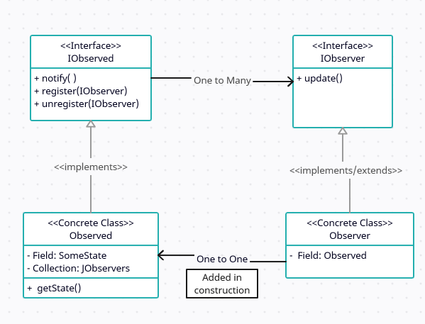

## UML

## Observer
   

Observers are added to **Observed**'s collection by invoking `register()` (and removed by `unregister()`), when state of **Observed**
changes it calls `notify()` which iterates through collection and calls `update()` of its members, in update method **Observer**s
can access `getState()` of **Observed** because they have it's instance passed to them in constructor (this is implementation
flavour: second way would be to pass state within `notify()` as an argument).

