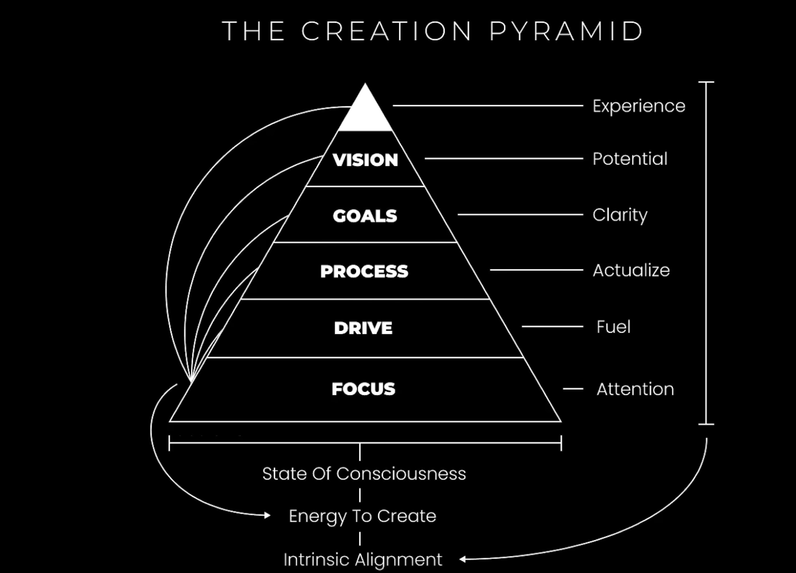
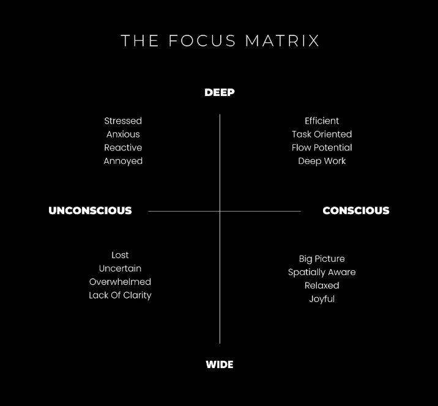

### Incorporate Tactical Stress: 
The conscious decision to put yourself in a do-or-die situation, while knowing that you have resources to deal with this task and accept nothing less than success. Feel the urgency
### Gain Clarity: 
Develop the Vision for your future, Have a clear goals in mind and roadmap how to get those goals to completion. Prioritize Vision over everything else. 

### Anxiety -> learn, Boredom -> rise the challenge
1.  **Visualise how you want to Act**: act in alignment with the vision of yourself. Behave in a way you would behave when your vision would be met.
2.  **Create crystal clear vision**
3.  **Set goals**: Goals that will allow you to create the future from your vision.
4.  **Process**: create a process that will lead to meeting your goals -> constantly assess and improve the process.
5.  **Levrage Drivers**:
- Curiosity 
- Passion 
- Purpose 
- Autonomy*
- Mastery*
6.  **Understand Focus**: 
 